# SolarSys

A client-side web application that generates animated solar-system SVG scenes.
Planets orbit a sun along cubic Bezier paths using SVG `animateMotion`, with
optional moons, rings, a starfield, a rotating asteroid belt, and comets.

Everything runs in the browser. There is no server runtime, no database, and no
network request involved in generating, previewing, or downloading a scene.

## Examples

Three scenes generated by `scripts/generate-readme-examples.ts` — open any of
them raw to see the orbits, moons, belt, and comets animate (GitHub's inline
preview shows the first frame only):

| Aurora | Ember | Abissal |
| :---: | :---: | :---: |
| [](docs/examples/aurora-classic.svg) | [](docs/examples/ember-red-giant.svg) | [](docs/examples/abissal-belt.svg) |
| Yellow dwarf, banded ring, moon | Red giant, asymmetric orbits | White dwarf, icy asteroid belt |

## Requirements

- Node.js 20.19+ or 22.12+ (the `engines` contract in `package.json`; `.nvmrc`
  pins the Node 22 line for nvm users)
- npm

## Setup

```bash
npm install
```

## Running

```bash
npm run dev        # development server
npm run build      # static production build into build/
npm run preview    # serve the production build
```

`npm run build` emits plain static assets. Serving `build/` from any static host
is sufficient; nothing else is required.

## Using the application

The interface exposes every user-owned parameter:

- canvas width and height, plus quick presets
- per-planet orbital distance: one value (circular) or, in Custom mode, four
  directional values (`left,top,right,bottom`, asymmetric)
- per-planet size, moon (enable/disable, size, distance, and period, default
  15s), and ring (enable/disable, type, size, and inclination) — edited in
  each planet's dialog
- scene-level asteroid belt: enable/disable, type, asteroid count, inner and
  outer radius (as a percentage of the orbit), asteroid size, and rotation
  period
- palette: `Random` (default) or one of Aurora, Ember, Abissal, Amethyst,
  Verdant, Mono

A **Pause/Play** control stops and resumes the previewed animation. If your
system asks for reduced motion, the scene starts paused and explains why; press
play to start it. Downloaded files always animate regardless.

The scene seed is a fixed, non-exposed constant: the application never shows
it, never lets you edit it, and never re-randomizes it. Values the generator
derives from that seed — planet orbital periods, star counts and positions,
ring colours, individual asteroid placement and rotation, comet count and
paths, and planet surface detail — are stable but deliberately not exposed as
controls.

Invalid input is rejected with a message naming the control and its accepted
range. Rejections appear inline at the offending control and in a screen-reader
summary; nothing is silently clamped, and the last valid scene stays on screen.

### Determinism and sharing

A scene is fully determined by its parameters plus the seed. Because the
application always generates from the same fixed seed, identical parameters
reproduce a byte-identical SVG across reloads, sessions, and machines. The
generator's `(params, seed)` API stays explicit, so the determinism suites can
pin seeds directly.

### Download

`Download SVG` writes the exact bytes of the previewed scene to
`solarsys-<seed>.svg`. The scene is serialized once: preview and download always
consume the identical string.

The downloaded file is self-contained. It animates when opened directly and when
embedded via ``, contains no `<script>`, and references no external
stylesheet, image, or font. It carries `<title>` and `<desc>`.

The exported file animates unconditionally and carries no pause control, because
that would require scripting and the file is deliberately script-free. Reduced
motion is honoured by the application, not by the artefact.

The root `<svg>` carries a `viewBox` but no intrinsic `width`/`height`, so it
scales to its container.

## Testing

```bash
npm run test               # all headless layers (Vitest)
npm run test:geometry      # geometry parity against the PHP oracle fixture
npm run test:determinism   # byte-identical repeat and cross-session generation
npm run test:structural    # document structure, integrity, metadata
npm run test:browser       # Chromium, Firefox, WebKit render + animate
npm run test:interaction   # control surface, validation, export
npm run test:reduced-motion
npm run test:presentation  # chrome: theme, layout, widgets, inline errors, focus
npm run test:density       # measured vertical budget of the control deck
npm run test:all           # headless + browser + interaction + density + reduced-motion + presentation
npm run typecheck          # tsc, strict
```

The browser, interaction, density, reduced-motion, and presentation suites
build the application and run Playwright against the served static output.

## Architecture

See [docs/ARCHITECTURE.md](docs/ARCHITECTURE.md) for the full invariants and
testing discipline.

```
ts/generator/   pure, DOM-free scene generation: params + seed -> SVG string
ts/app/         the DOM layer: controls, validation, store, preview, download
tests-ts/       headless suites (geometry parity, determinism, structural)
e2e/            Playwright suites (browser, interaction, reduced motion, presentation)
openspec/       the migration's specs, design, traceability, and tasks
```

The application chrome (dark minimal theme, responsive two-pane layout, planet
cards, inline validation errors) lives in `ts/app/styles.css` and the `ts/app/`
DOM modules, under the `ui-presentation` (UI-*) and `control-ux` (CX-*)
capabilities. It is presentation-only: it never touches the generator, the
store's single-serialization rule, or the export contract.

The generator never imports UI code and never touches the DOM, which is what
makes most of the suite runnable without a browser. All randomness flows through
one explicitly threaded seeded PRNG, and element identifiers are seed-derived
counters — so **generation order is contractual**: reordering render calls
changes every downstream id and breaks reproducibility.

## Origins

SolarSys began as a PHP SVG generator and was migrated to this TypeScript
implementation. The geometry parity suite reads a committed fixture
(`tests-ts/fixtures/geometry-oracle.json`) captured from the original PHP
renderer, so parity remains verifiable without PHP installed.
